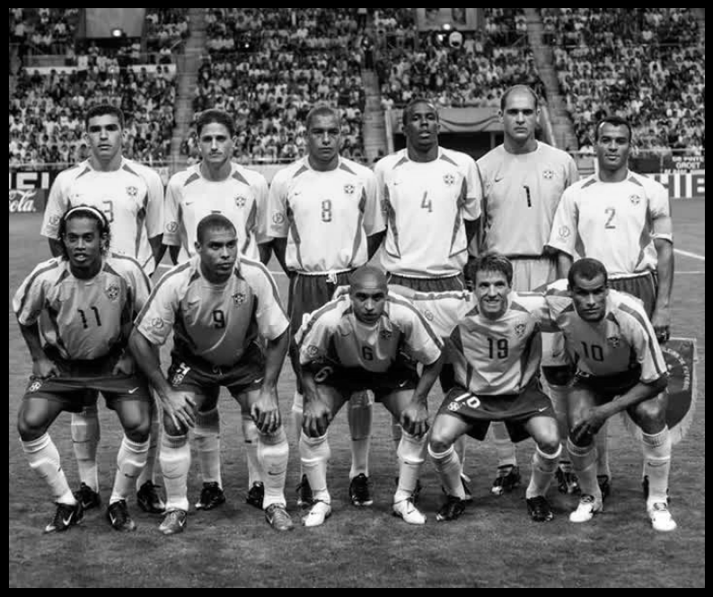
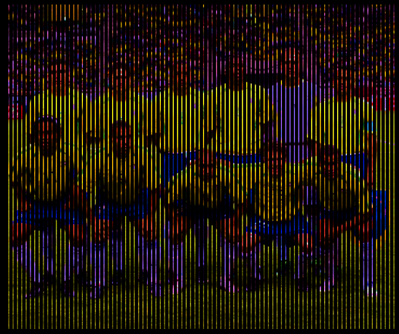
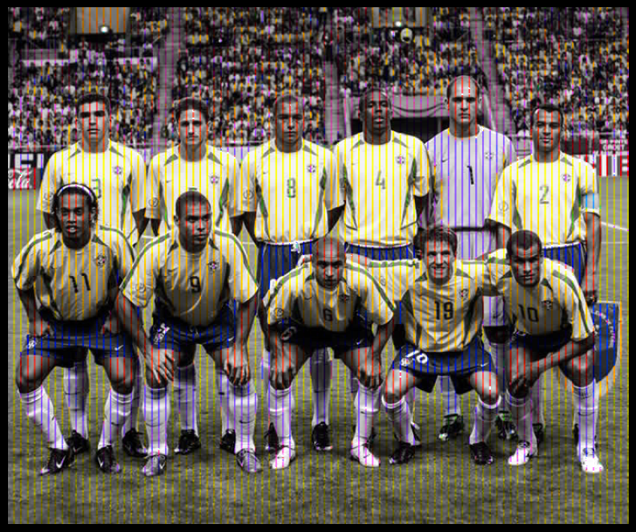

# Color Assimilation 

An exploratory project for the study of color assimilation still a work in progress.

  Motivation  

 

Primarily inspired by the work of [@AkiyoshiKitaoka](https://x.com/AkiyoshiKitaoka/status/1812708603826163940).
 
Example:

result:

 

See [color_assimilation.ipynb](./color_assimilation.ipynb) for code.

  

## Authors

- [@jro17002](https://www.github.com/jro17002)

## Acknowledgements

 - [@AkiyoshiKitaoka](https://x.com/AkiyoshiKitaoka)
 - [The effect of luminance differences on color assimilation ](https://jov.arvojournals.org/article.aspx?articleid=2707505)
